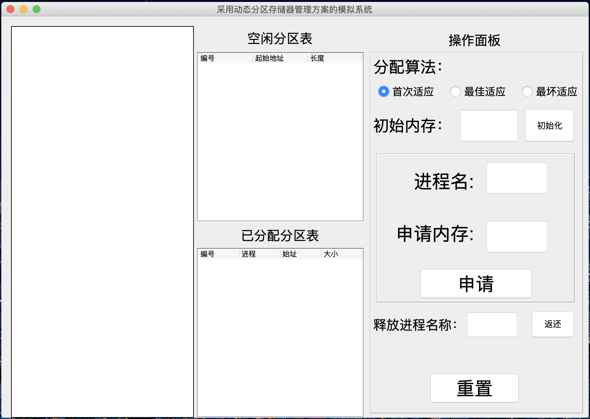
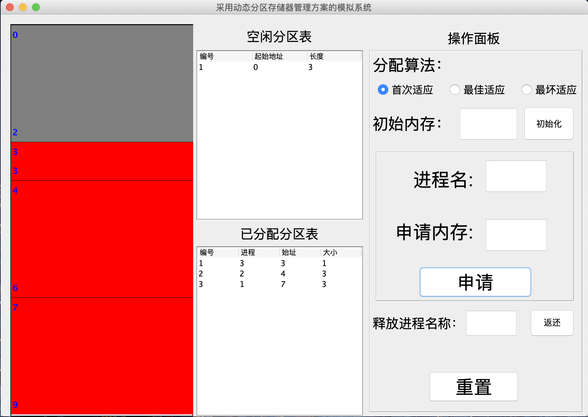
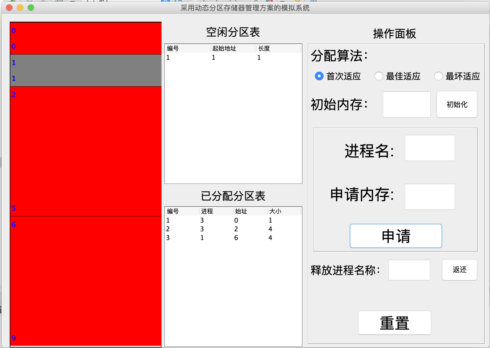
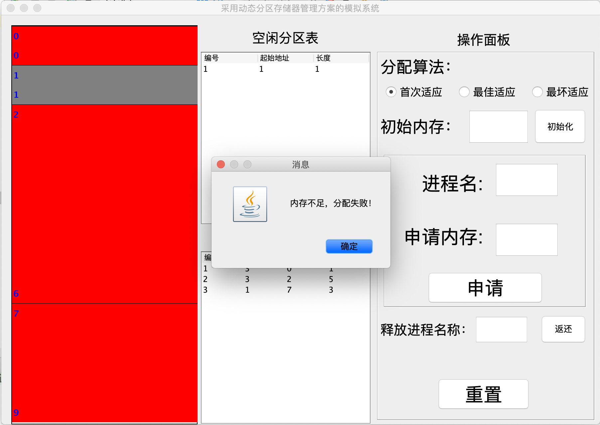
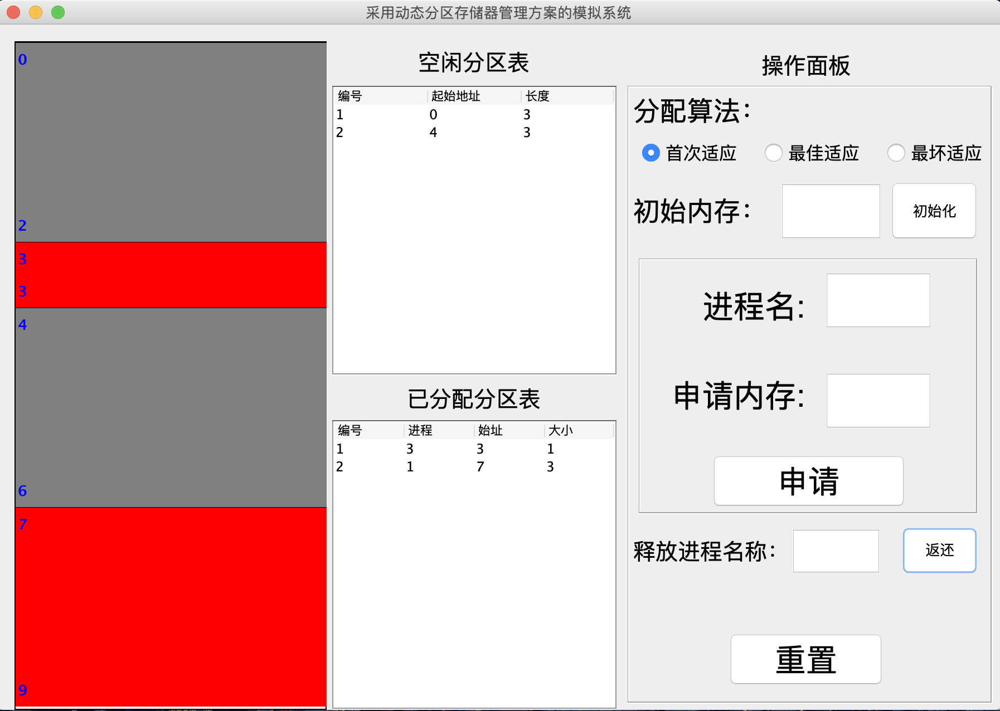
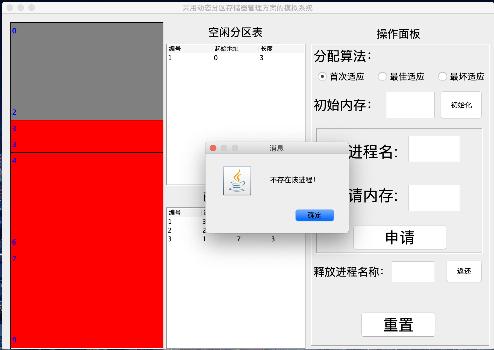

# 基于动态分区算法（FF，BF，WF）的内存分配模拟程序

**作者：积极向上小木木 &nbsp;&nbsp;&nbsp;&nbsp;&nbsp;&nbsp;&nbsp;&nbsp;&nbsp;&nbsp;&nbsp;联系方式：PositiveMumu@126.com**

*基于动态分区算法的内存分配模拟程序，包括首次适应算法，最佳适应算法、最坏适应算法。*

[TOC]

## 一、项目功能
1. 提供三种动态分区模拟算法：首次适应算法，最佳适应算法，最坏适应算法。
2. 利用画布动态显示内存分区当前情况（灰色为空闲，红色为已分配）。
3. 显示空闲分区链及已分配的内存块情况。
4. 内存初始容量自行设定，使用前请初始化内存。
5. 分配算法可以自由选择，在运行期间也可以更换算法（但空闲分区链并不会按算法显示）。
6. 用户可随时添加新进程，输入进程名和长度后程序按照当前的分配算法进行分配，内存默认分配空闲内存块的高地址部分。
7. 当申请内存容量大于任意一块空闲内存的大小时，将实行紧凑算法，程序将从后向前搜索空闲分区并计数，当空闲空间块的总容量大于进程需求容量时，算法停止搜索，将搜索最后一个空闲分区块之前的所有已分配的内存块向前移动，将几个空闲分区块合并并放在高地址部分，然后执行正常分配算法，将当前合并的空闲分区块按高地址部分分出。
8. 如果当前紧凑算法结束，合并后的空闲分区块仍无法满足申请内存的需求，则会提示”内存不足，无法分配。“
9. 用户可随时将申请的内存块释放，输入进程名称并点击返还即可释放内存。
10. 当进程名称不存在时，系统将给出错误提示。

## 二、项目信息

1. 项目使用IDEA_2017.3.5完成。

2. 在本项目中，笔者为IDEA添加了JFormDesigner插件，制作与修改客户端各个页面时需要用到这个插件。插件的安装及破解请自行百度。

3. JDK版本为1.8_211。

## 三、项目截图
1. 主界面：

  

2. 申请内存：

  

3. 紧凑：

  

4. 申请内存失败：

  

5. 释放内存：

  

6. 释放内存失败：

	

